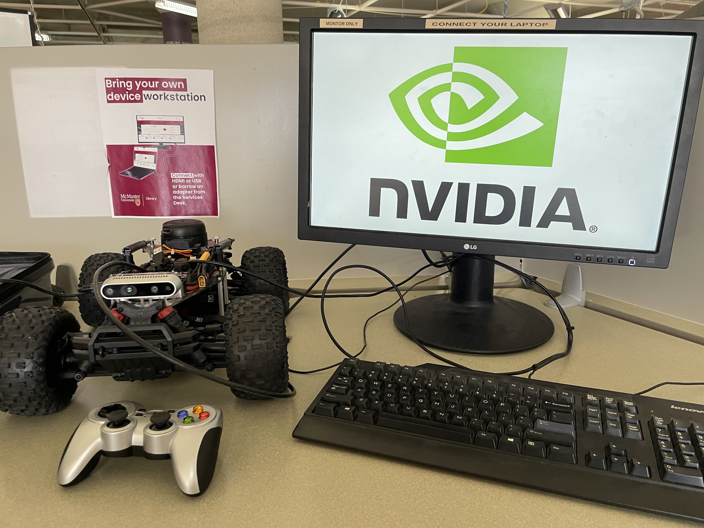
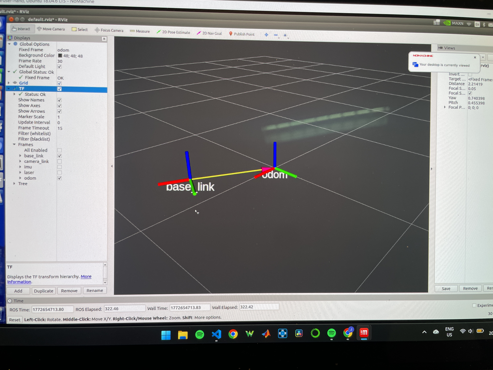

# 🚗 Autonomous Vehicle Navigation and Mapping

## 📌 Project Summary
This project explores the fundamentals of **autonomous vehicle navigation and mapping**. It focuses on how a vehicle can understand its surroundings, determine its position, and navigate safely through an environment.

Key components include:
- Mapping the environment  
- Localizing the vehicle within the map  
- Planning paths from one point to another  

The goal is to simulate core concepts used in real-world self-driving systems, combining robotics, perception, and intelligent decision-making.

---

## 🖼️ Images

